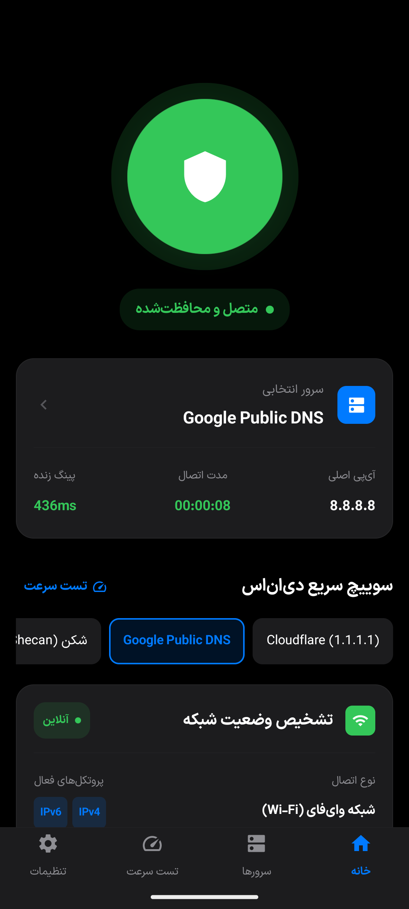
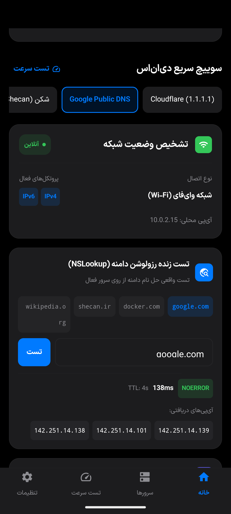
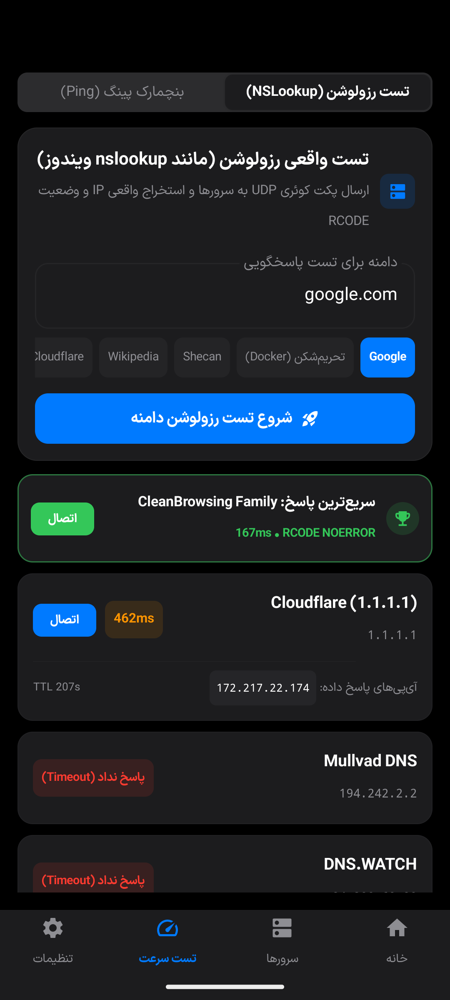
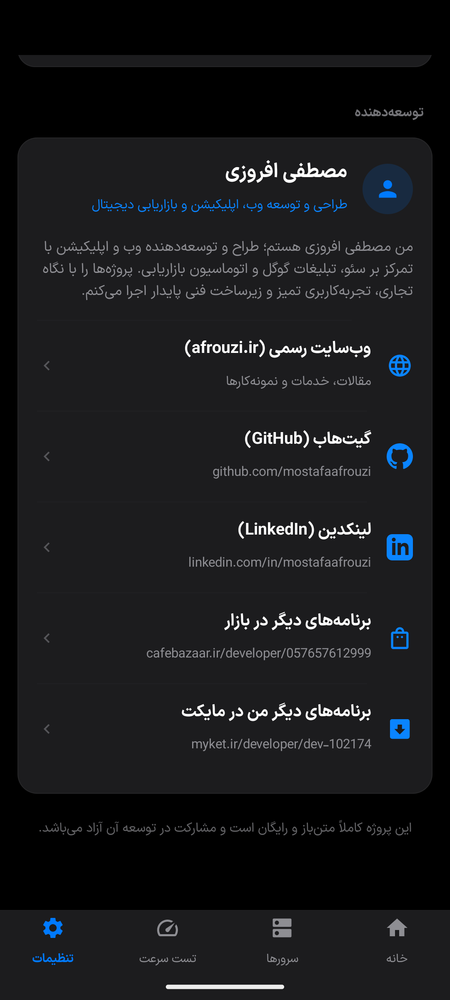
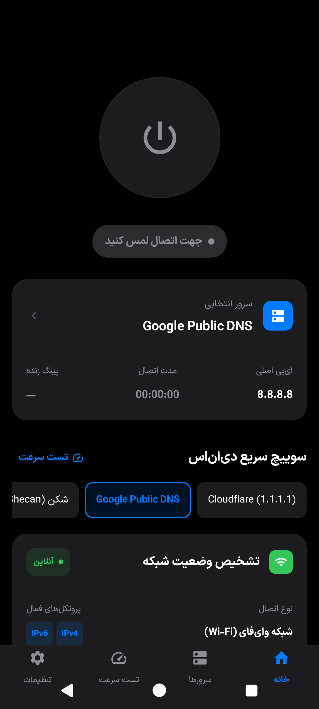
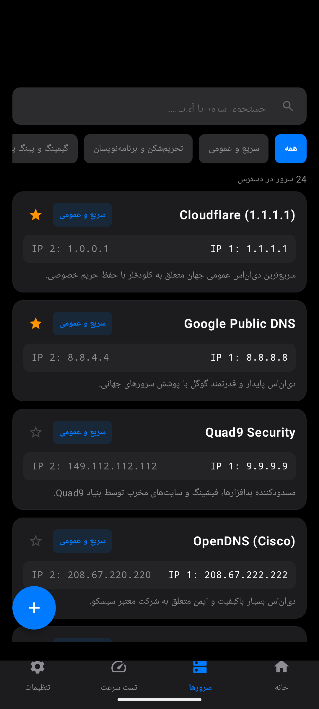

# دی‌ان‌اس مستر پرو | DNS Master Pro

**فارسی** · [English](README.en.md)

اپلیکیشن اندروید فوق‌حرفه‌ای، سریع و مینیمال برای تغییر DNS و بنچمارک سرعت سرورها، با تایپوگرافی اختصاصی **ایران‌سنس ایکس (IRANSansX Eco)**، موتور تست واقعی رزولوشن **NSLookup RFC 1035**، معماری طراحی برگرفته از **Apple iOS Human Interface Guidelines (HIG)**، پشتیبانی پیش‌فرض از سرورهای تحریم‌شکن ایرانی و معتبرترین DNSهای جهان، کاملاً متن‌باز و بدون تبلیغات.

<div dir="ltr">

[](https://github.com/mostafaafrouzi/android-dns-changer/releases/latest)
[-3DDC84?style=flat-square&logo=android)](https://android.com)
[](https://developer.apple.com/design/human-interface-guidelines/)
[](https://fontiran.com)
[](LICENSE)
[](#حریم-خصوصی-و-امنیت)

</div>

---

## چرا دی‌ان‌اس مستر پرو؟

بیشتر برنامه‌های تغییر DNS در گوگل‌پلی آکنده از **تبلیغات اجباری ویدیویی** و پاپ‌آپ هستند، مصرف باتری بالایی دارند، اینترنت کاربر را در صورت قطعی مختل می‌کنند و از استانداردهای مدرن طراحی به دورند.

**«دی‌ان‌اس مستر پرو»** با رویکرد مینیمال و استانداردهای طراحی اپل iOS (شامل کارت‌های Inset Grouped، کنترل‌های Segmented، انیمیشن‌های فیزیکی کشسانی، و پالت رنگی رسمی Apple System Colors) توسعه داده شده است. موتور مسیریابی محلی آن، ترافیک اینترنت را دست‌نخورده باقی گذاشته و **تنها پکت‌های کم‌حجم پورت ۵۳ (DNS)** را به سرور دلخواه هدایت می‌کند؛ بنابراین کوچک‌ترین افت سرعتی در دانلود یا وبگردی ایجاد نمی‌شود.

---

## قابلیت‌های کلیدی

### ۱. تایپوگرافی اصیل با فونت ایران‌سنس ایکس (IRANSansX Eco)
- ادغام کامل فونت خانواده **ایران‌سنس ایکس اکو** برای متون فارسی با تنظیمات دقیق `includeFontPadding = false` و تراز عمودی خطوط.
- نمایش اعداد و حروف با خوانایی فوق‌العاده در تمام اندازه‌ها و وزن‌های نوشتاری.

### ۲. موتور تست واقعی رزولوشن دامنه (NSLookup RFC 1035)
- شبیه‌ساز واقعی دستور `nslookup` ویندوز و لینوکس از طریق ارسال مستقیم پکت‌های خام UDP بر روی پورت ۵۳.
- استخراج و نمایش آی‌پی‌های پاسخ داده شده، وضعیت پاسخ سرور (RCODE مانند NOERROR / SERVFAIL / TIMEOUT)، تاخیر رفت‌وبرگشت (Latency) و مدت اعتبار رکورد (TTL).
- **تاییدیه عبور از تحریم (Anti-Sanction Verified):** اعتبارسنجی خودکار توانایی سرورها در دور زدن تحریم دامنه‌هایی چون `docker.com` و `developer.android.com` و نمایش نشان سبز اعتبارسنجی.
- ابزار بازرسی زنده در صفحه اصلی و بنچمارک مقایسه‌ای همه‌جانبه در صفحه تست سرعت.

### ۳. ناوبری استاندارد متناسب با انواع تنظیمات اندروید
- هماهنگی ۱۰۰٪ با **ناوبری ۳ دکمه‌ای (Back, Home, Overview)** و **ناوبری با ژست حرکتی (Gesture Navigation)**.
- رعایت استاندارد Insets جهت جلوگیری از هرگونه تداخل یا پوشانده شدن دکمه‌های ناوبری توسط سیستم‌عامل.

### ۴. زبان طراحی مینیمال اپل (Apple iOS HIG)
- **کارت‌های چندلایه Inset Grouped:** چیدمان منظم، فاصله حاشیه‌ای استاندارد و تفکیک محتوا.
- **کنترل‌های تفکیک‌شده (Segmented Controls):** سوئیچ بین حالت‌های تست و تنظیمات با انیمیشن‌های نرم iOS.
- **پالت رنگی رسمی Apple System:** رنگ‌های `#007AFF` (Apple Blue)، `#34C759` (Apple Green)، `#FF9500` (Apple Orange) و مشکی مطلق OLED (`#000000`) در حالت دارک، همراه با حالت لایت یکدست (`#F2F2F7`).
- **فلش‌های خروجی سازگار با جهت متن:** فلش انتخاب سرور و آیتم‌ها در زبان فارسی و انگلیسی همواره به سمت لبه بیرونی صفحه جهت‌گیری دارند.

### ۵. پایداری ۱۰۰٪ موتور DNS بدون قطعی اینترنت
- معماری ایزوله‌سازی روتینگ روی اینترفیس محلی TUN (`192.0.2.1/32` و `192.0.2.53/32`)؛ وب‌سایت‌ها و اپلیکیشن‌ها با ۰٪ پکت‌لاست و با نهایت سرعت بارگذاری می‌شوند.

### ۶. پشتیبانی پیش‌فرض از سرورهای تحریم‌شکن و بین‌المللی
- **سرویس‌های ضد تحریم ایرانی:** شکن (Shecan)، ۴۰۳ آنلاین (403.online)، بگذر (Begzar)، الکترو (Electro) و رادار گیم (Radar Game).
- **سرویس‌های برتر جهانی:** Cloudflare (1.1.1.1)، Google Public DNS (8.8.8.8)، Quad9 Security، OpenDNS سیسکو، AdGuard، Mullvad و CleanBrowsing.

### ۷. کاشی تنظیمات سریع و اعلان دکمه‌دار پایدار
- دکمه میانبر (Quick Settings Tile) در پنل نوتیفیکیشن اندروید.
- دکمه مستقیم **«قطع اتصال»** در اعلان زنده با پاسخگویی آنی بر روی تمامی نسخه‌های اندروید.

### ۸. صفحه درباره جامع و راه‌های ارتباطی
- بیوگرافی توسعه‌دهنده همراه با لینک‌های وب‌سایت رسمی (دارای برچسب‌های UTM متناسب با زبان)، گیت‌هاب، لینکدین و دسترسی مستقیم به دیگر برنامه‌ها در کافه‌بازار و مایکت.

---

## گالری تصاویر

<div align="center">

| صفحه اصلی (تیره - متصل) | بازرس زنده NSLookup | بنچمارک رزولوشن دامنه |
| :---: | :---: | :---: |
|  |  |  |

| درباره توسعه‌دهنده و لینک‌ها | سازگاری با ناوبری ۳ دکمه‌ای | لیست کامل سرورها |
| :---: | :---: | :---: |
|  |  |  |

</div>

---

## حریم خصوصی و امنیت

- **کاملاً بدون تبلیغات:** هیچ بنر یا تبلیغی درون برنامه گنجانده نشده است.
- **بدون ترکر و آنالیتیکس:** داده‌های هویتی، آدرس‌های وب و گزارشات شما ذخیره یا به سرور ثالثی ارسال نمی‌شوند.
- **مسیریابی فقط-DNS:** این اپ فیلترشکن نیست؛ دانلودها و ترافیک شخصی شما مستقیماً توسط اینترنت خودتان جابجا می‌شوند و از سرورهای واسط عبور نمی‌کنند.

---

## برای توسعه‌دهندگان

<div dir="ltr">

| مشخصه | مقدار |
| :--- | :--- |
| Application ID | `com.afrouzi.dnsmaster` |
| minSdk / targetSdk / compileSdk | 24 / 36 / 36 |
| Kotlin / Compose Compiler | 2.0.21 |
| Version | 1.2.0 |

</div>

### بیلد و نصب محلی

```bash
# دریافت سورس کد
git clone https://github.com/mostafaafrouzi/android-dns-changer.git
cd android-dns-changer

# بیلد نسخه دیباگ
./gradlew assembleDebug

# بیلد نسخه نهایی
./gradlew assembleRelease

# نصب روی دستگاه یا امولاتور
adb install -r app/build/outputs/apk/release/app-release.apk
```

---

## دریافت آخرین نسخه

- **GitHub Releases:** [دانلود فایل APK از صفحه انتشار گیت‌هاب](https://github.com/mostafaafrouzi/android-dns-changer/releases/latest)

---

## درباره سازنده

طراحی و توسعه‌یافته توسط **مصطفی افروزی**:
- وب‌سایت: [afrouzi.ir](https://afrouzi.ir/?utm_source=dnsmaster&utm_medium=github_readme&utm_campaign=dnsmaster)
- گیت‌هاب: [github.com/mostafaafrouzi](https://github.com/mostafaafrouzi)
- لینکدین: [linkedin.com/in/mostafaafrouzi](https://linkedin.com/in/mostafaafrouzi)
- برنامه‌های من در کافه‌بازار: [cafebazaar.ir/developer/057657612999](https://cafebazaar.ir/developer/057657612999)
- برنامه‌های من در مایکت: [myket.ir/developer/dev-102174](https://myket.ir/developer/dev-102174)

---

## مجوز (License)

این پروژه تحت مجوز [MIT License](LICENSE) منتشر شده است.
