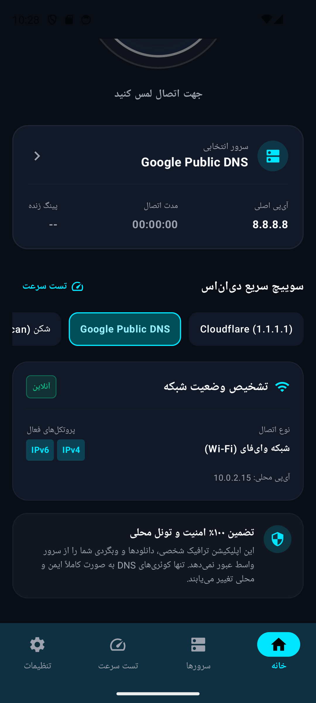
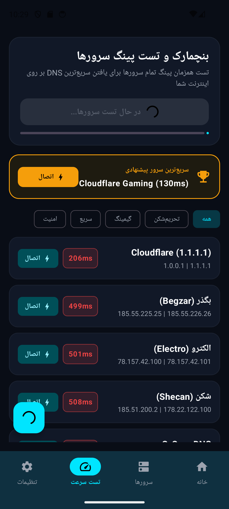
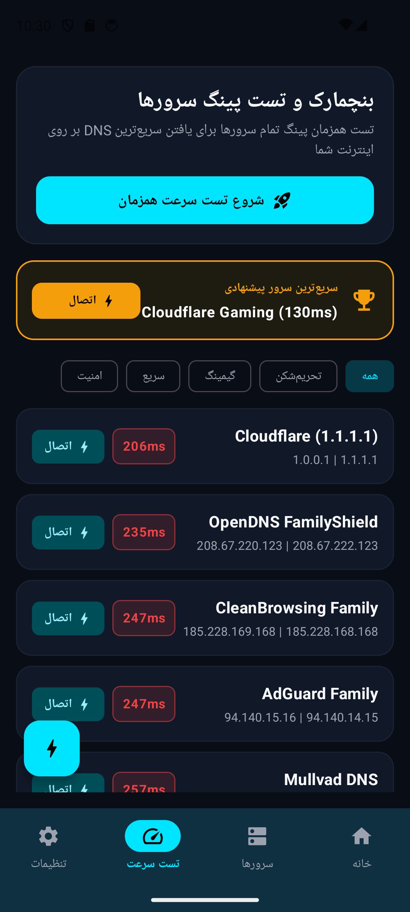
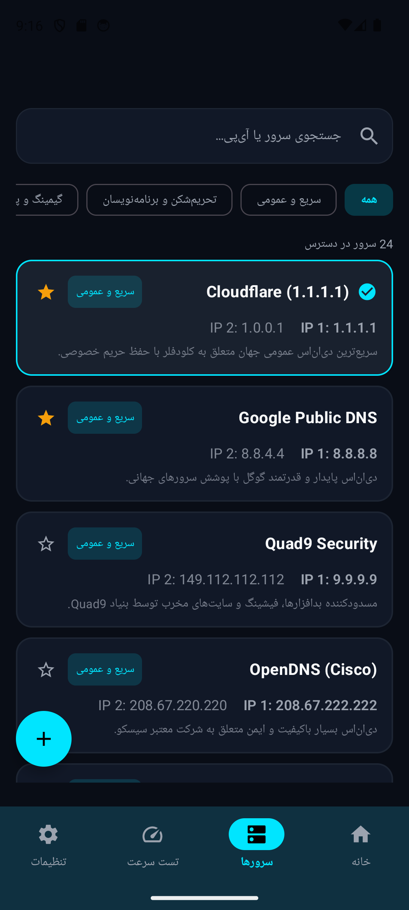
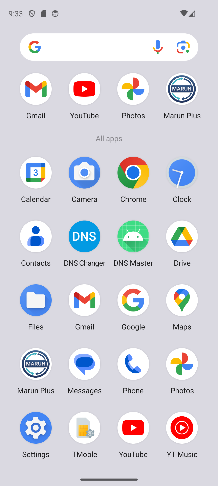
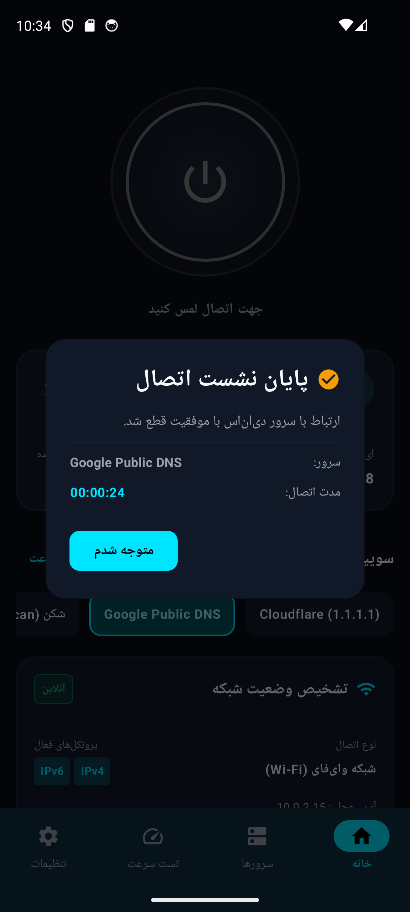

# دی‌ان‌اس مستر پرو | DNS Master Pro

**فارسی** · [English](README.en.md)

اپلیکیشن اندروید مدرن، امن و فوق‌سریع برای تغییر دی‌ان‌اس و تست پینگ سرورها، با پشتیبانی پیش‌فرض از سرورهای تحریم‌شکن، کاملاً بدون تبلیغات و با رابط کاربری تاریک نئونی.

<div dir="ltr">

[](https://github.com/mostafaafrouzi/android-dns-changer/releases/latest)
[-3DDC84?style=flat-square&logo=android)](https://android.com)
[](LICENSE)
[](#حریم-خصوصی-و-امنیت)
[](https://m3.material.io)

</div>

---

## چرا دی‌ان‌اس مستر پرو؟

بیشتر برنامه‌های تغییر DNS در فروشگاه‌های اندرویدی با **تبلیغات آزاردهنده تمام‌صفحه و ویدیوهای اجباری** پر شده‌اند، رابط کاربری خسته‌کننده‌ای دارند و از سرورهای تحریم‌شکن ایرانی پشتیبانی نمی‌کنند.

«دی‌ان‌اس مستر پرو» با زبان طراحی سایبرپانک و نئونی، عملکرد آنی و امنیت حداکثری ساخته شده است. این اپلیکیشن به صورت ۱۰۰٪ محلی از طریق یک تونل سبک VPN فقط و فقط بسته‌های سبک DNS را به سمت سرور منتخب شما هدایت می‌کند؛ بنابراین **هیچ ترافیک شخصی، دانلود یا وبگردی از سرورهای واسط رد نمی‌شود و سرعت دانلود شما کوچک‌ترین کاهشی پیدا نمی‌کند.**

---

## قابلیت‌های کلیدی

### ۱. سرورهای پیش‌فرض تحریم‌شکن و جهانی
- **سرویس‌های ضد تحریم ایرانی:** شکن (Shecan)، ۴۰۳ آنلاین (403.online)، الکترو (Electro)، بگذر (Begzar) و رادار گیم (Radar Game) برای برنامه‌نویسان، گیمرها و امور روزمره.
- **ارائه‌دهندگان معتبر جهانی:** Cloudflare (1.1.1.1)، Google Public DNS، Quad9 Security، سیسکو OpenDNS، AdGuard، Mullvad و CleanBrowsing.
- **پشتیبانی کامل از رکوردهای دوگانه:** ثبت همزمان آدرس‌های IPv4 و IPv6.

### ۲. بنچمارک و تست سرعت زنده (Multi-Server Ping)
- ارسال پکت‌های واقعی UDP DNS و محاسبه دقیق تاخیر زمانی (Ping بر حسب میلی‌ثانیه).
- شناسایی و معرفی خودکار سریع‌ترین سرور در **کارت جایزه طلایی (Spotlight Trophy Card)**.
- دکمه فوری **«اتصال ⚡»** روی تک‌تک کارت‌های نتایج سرعت جهت اعمال آنی بدون نیاز به تغییر صفحه.
- فیلتر هوشمند نتایج بر اساس دسته‌بندی‌های: **همه**، **تحریم‌شکن**، **گیمینگ**، **سریع** و **امنیت**.
- دکمه شناور (FAB) برای تکرار تست از هر کجای صفحه.

### ۳. کارت هوشمند تشخیص وضعیت شبکه (Network Diagnostics)
- تشخیص آنی نوع شبکه فعال دستگاه (**وای‌فای Wi-Fi** یا **دیتای سیم‌کارت Cellular**).
- نشانگر آنلاین بودن اینترنت.
- نمایش پروتکل‌های فعال دستگاه (**IPv4** و **IPv6**).
- نمایش آی‌پی محلی دستگاه (**Local Device IP**).

### ۴. تضمین ۱۰۰٪ امنیت و تونل محلی (Local Resolver)
- شفافیت کامل با کاربر: این اپلیکیشن فیلترشکن نیست و داده‌های خصوصی یا دانلودهای شما را از سرور واسط عبور نمی‌دهد؛ بلکه فقط نام دامنه‌ها را از سرور DNS منتخب شما دریافت می‌کند.

### ۵. کاشی تنظیمات سریع (Quick Settings Tile)
- دکمه اختصاصی در نوار بالای اندروید (کنترل سنتر) برای روشن و خاموش کردن سریع دی‌ان‌اس بدون نیاز به باز کردن برنامه.

### ۶. دیالوگ خلاصه نشست اتصال (Session Summary)
- پس از قطع اتصال، دیالوگی مرتب با تیک طلایی، زمان دقیق مدت اتصال نشست و نام سرور استفاده‌شده را گزارش می‌دهد.

### ۷. دی‌ان‌اس سفارشی (Custom DNS)
- امکان تعریف سرورهای دلخواه با نام، دسته‌بندی و آی‌پی اصلی و ثانویه همراه با اعتبارسنجی خودکار فرمت‌های IPv4 و IPv6.

---

## گالری تصاویر

<div align="center">

| صفحه اصلی (متصل و پینگ زنده) | کارت تشخیص شبکه و تضمین امنیت |
| :---: | :---: |
|  |  |

| بنچمارک سرعت و دکمه‌های اتصال | فیلتر دسته‌بندی گیمینگ و تحریم‌شکن |
| :---: | :---: |
|  |  |

| لیست سرورهای پیش‌فرض | افزودن دی‌ان‌اس سفارشی |
| :---: | :---: |
|  |  |

| دیالوگ پایان نشست اتصال | اعلان نوار وظیفه با کلید قطع اتصال |
| :---: | :---: |
|  |  |

</div>

---

## حریم خصوصی و امنیت

- **بدون تبلیغات:** حتی یک بنر یا تبلیغ درون‌برنامه‌ای وجود ندارد.
- **بدون آنالیتیکس و ردیاب:** هیچ اطلاعاتی از دستگاه یا عادات وبگردی شما به هیچ سروری ارسال نمی‌شود.
- **تونل محلی:** تونل VPN تنها روی پورت ۵۳ (DNS) به صورت محلی در خود گوشی کار می‌کند.

### دسترسی‌های سیستم

| دسترسی | دلیل استفاده |
| :--- | :--- |
| `BIND_VPN_SERVICE` | ایجاد تونل محلی جهت ارسال کوئری‌های DNS به سرور دلخواه |
| `FOREGROUND_SERVICE` | زنده نگه‌داشتن سرویس تغییر DNS در پس‌زمینه اندروید |
| `POST_NOTIFICATIONS` | نمایش وضعیت اتصال و دکمه قطع در پنل اعلان‌ها (اندروید ۱۳+) |
| `RECEIVE_BOOT_COMPLETED` | اتصال مجدد خودکار پس از روشن شدن گوشی (در صورت فعال‌سازی در تنظیمات) |

---

## برای توسعه‌دهندگان

### فناوری‌های استفاده‌شده

- **زبان:** Kotlin
- **رابط کاربری:** Jetpack Compose (Material 3) با پالت رنگی Dark Neon & Glassmorphism
- **معماری:** Clean Architecture + MVVM + StateFlow
- **شبکه و VPN:** Android `VpnService` با مدیریت پاکت‌های خام DNS از طریق `FileInputStream` و `FileOutputStream`
- **تست پینگ:** سوکت UDP با ارسال پکت Query دامنه `google.com` و محاسبه RTT
- **تنظیمات محلی:** Jetpack DataStore Preferences

<div dir="ltr">

| مشخصه | مقدار |
| :--- | :--- |
| Application ID | `com.afrouzi.dnsmaster` |
| minSdk / targetSdk / compileSdk | 24 / 36 / 36 |
| Kotlin / Compose Compiler | 2.0.21 |
| Version | 1.0.0 (Build 1) |

</div>

### ساخت و اجرای محلی

```bash
# دریافت سورس کد
git clone https://github.com/mostafaafrouzi/android-dns-changer.git
cd android-dns-changer

# بیلد نسخه دیباگ
./gradlew assembleDebug

# نصب روی امولاتور یا دستگاه متصل
adb install -r app/build/outputs/apk/debug/app-debug.apk
```

### ساخت نسخه Release

برای ساخت بیلد امضاشده، فایل `keystore.properties` را در ریشه پروژه قرار دهید:

```properties
storeFile=keystore/dnsmaster-release.jks
storePassword=...
keyAlias=dnsmaster
keyPassword=...
```

سپس دستور زیر را اجرا کنید:

```bash
./gradlew assembleRelease bundleRelease
```

---

## دریافت آخرین نسخه

- **GitHub Releases:** [صفحه دانلود آخرین نسخه (APK)](https://github.com/mostafaafrouzi/android-dns-changer/releases/latest)

---

## لایسنس

این پروژه تحت مجوز [MIT License](LICENSE) منتشر شده است.
