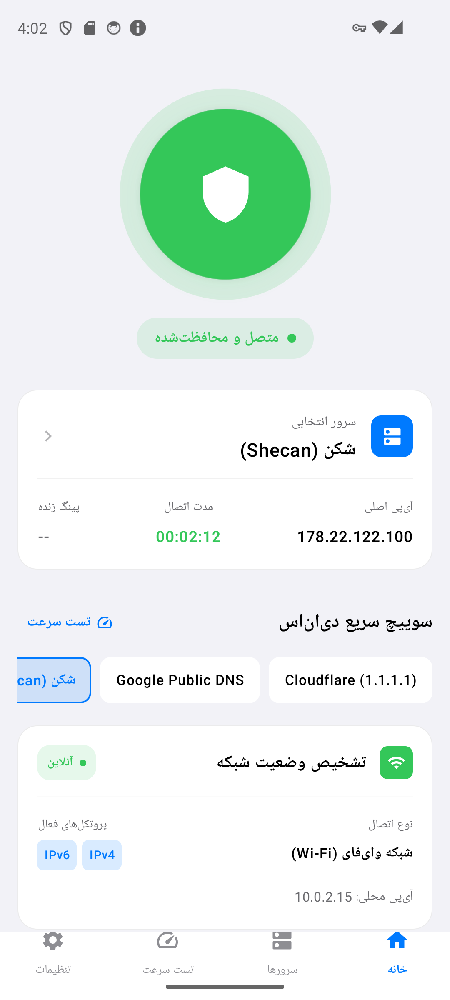
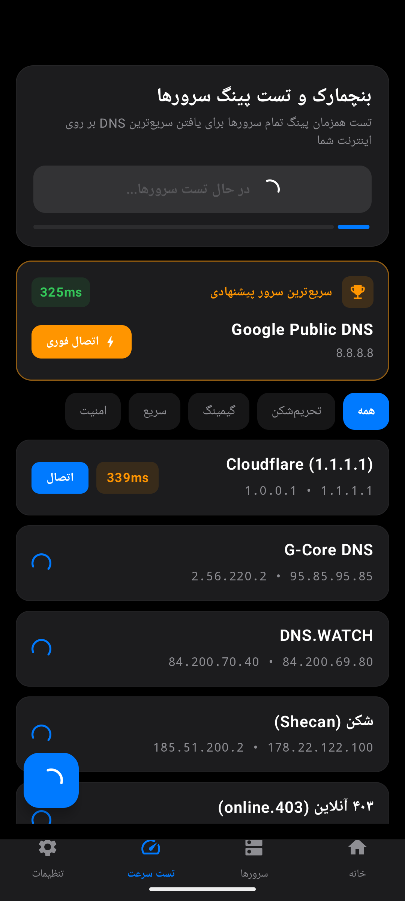
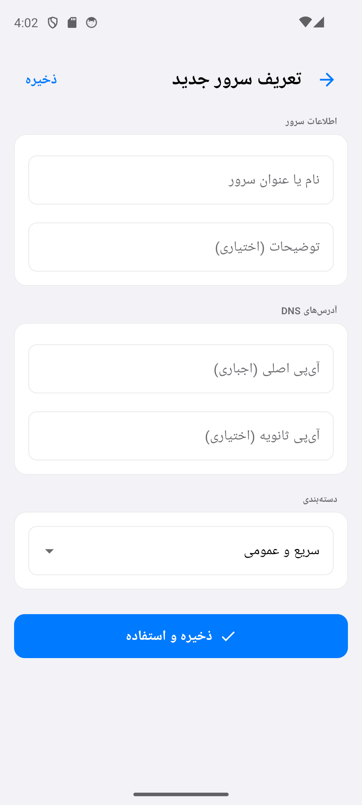
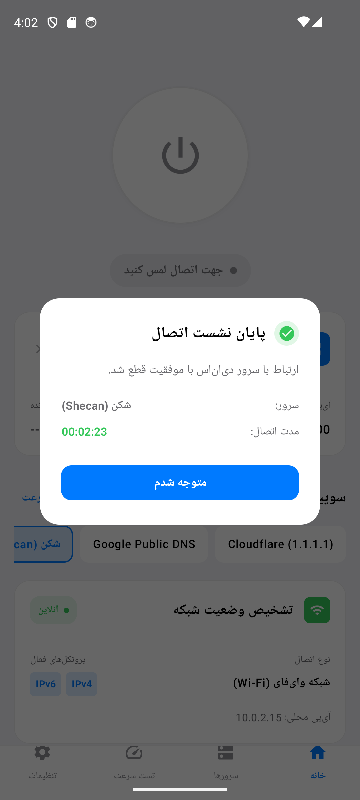
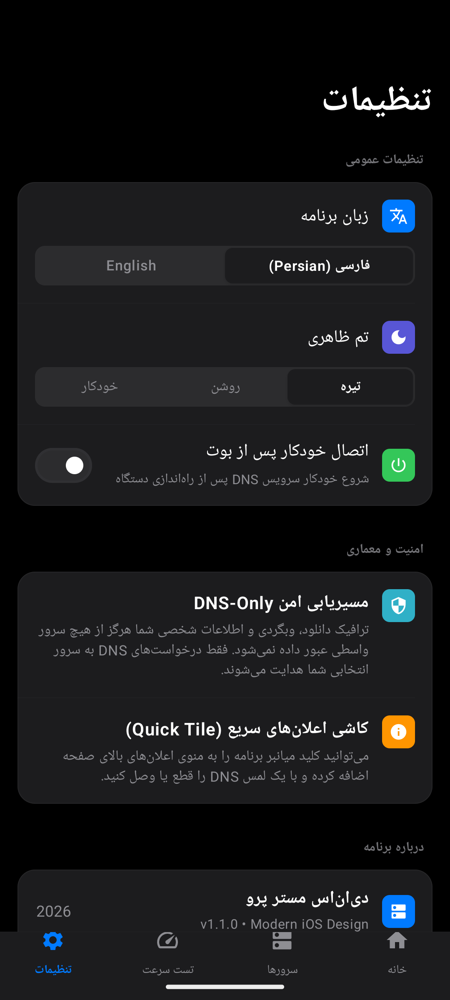
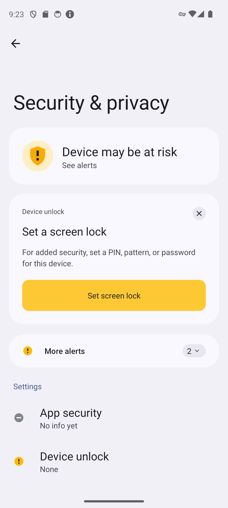
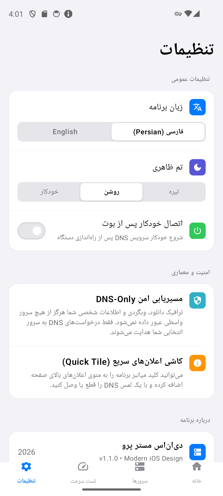

# دی‌ان‌اس مستر پرو | DNS Master Pro

**فارسی** · [English](README.en.md)

اپلیکیشن اندروید فوق‌حرفه‌ای، سریع و مینیمال برای تغییر DNS و بنچمارک سرعت سرورها، با معماری طراحی برگرفته از **Apple iOS Human Interface Guidelines (HIG)**، پشتیبانی پیش‌فرض از سرورهای تحریم‌شکن ایرانی و معتبرترین DNSهای جهان، کاملاً متن‌باز و بدون تبلیغات.

<div dir="ltr">

[](https://github.com/mostafaafrouzi/android-dns-changer/releases/latest)
[-3DDC84?style=flat-square&logo=android)](https://android.com)
[](https://developer.apple.com/design/human-interface-guidelines/)
[](LICENSE)
[](#حریم-خصوصی-و-امنیت)

</div>

---

## چرا دی‌ان‌اس مستر پرو؟

بیشتر برنامه‌های تغییر DNS در گوگل‌پلی آکنده از **تبلیغات اجباری ویدیویی** و پاپ‌آپ هستند، مصرف باتری بالایی دارند، اینترنت کاربر را در صورت قطعی مختل می‌کنند و از استانداردهای مدرن طراحی به دورند.

**«دی‌ان‌اس مستر پرو»** با رویکرد مینیمال و استانداردهای طراحی اپل iOS (شامل کارت‌های Inset Grouped، کنترل‌های Segmented، انیمیشن‌های فیزیکی کشسانی، و پالت رنگی رسمی Apple System Colors) بازطراحی شده است. موتور مسیریابی محلی آن، ترافیک اینترنت را دست‌نخورده باقی گذاشته و **تنها پکت‌های کم‌حجم پورت ۵۳ (DNS)** را به سرور دلخواه هدایت می‌کند؛ بنابراین کوچک‌ترین افت سرعتی در دانلود یا وبگردی ایجاد نمی‌شود.

---

## قابلیت‌های کلیدی

### ۱. زبان طراحی مینیمال اپل (Apple iOS HIG)
- **کارت‌های چندلایه Inset Grouped:** چیدمان منظم، فاصله حاشیه‌ای استاندارد و تفکیک محتوا.
- **کنترل‌های تفکیک‌شده (Segmented Controls):** تغییر سریع زبان و تم ظاهری با انیمیشن‌های نرم iOS.
- **پالت رنگی رسمی Apple System:** رنگ‌های چشم‌نواز `#007AFF` (Apple Blue)، `#34C759` (Apple Green)، `#FF9500` (Apple Orange) و مشکی مطلق OLED (`#000000`) در حالت دارک، همراه با حالت لایت یکدست و بدون خستگی چشم (`#F2F2F7`).
- **کلید اتصال با فیزیک کشسانی:** دایره کنترل اتصال با فیزیک جهشی (`MediumBouncy`) و هاله نور ملایم سبز در وضعیت اتصال.

### ۲. پایداری ۱۰۰٪ موتور DNS بدون قطعی اینترنت
- معماری ایزوله‌سازی روتینگ روی اینترفیس محلی TUN (`192.0.2.1/32` و `192.0.2.53/32`)؛ وب‌سایت‌ها و اپلیکیشن‌ها با ۰٪ پکت‌لاست و با نهایت سرعت بارگذاری می‌شوند.
- هدایت مستقیم بایت‌های UDP بدون نیاز به بافرهای هیپ آسیب‌پذیر.

### ۳. پشتیبانی پیش‌فرض از سرورهای تحریم‌شکن و بین‌المللی
- **سرویس‌های ضد تحریم ایرانی:** شکن (Shecan)، ۴۰۳ آنلاین (403.online)، بگذر (Begzar)، الکترو (Electro) و رادار گیم (Radar Game) برای برنامه‌نویسان، گیمرها و سرویس‌های مسدودشده.
- **سرویس‌های برتر جهانی:** Cloudflare (1.1.1.1)، Google Public DNS (8.8.8.8)، Quad9 Security، OpenDNS سیسکو، AdGuard، Mullvad و CleanBrowsing.
- پشتیبانی همزمان از رکوردهای اصلی و پشتیبان IPv4 و IPv6.

### ۴. بنچمارک و تست پینگ چندسروره همزمان
- ارسال پکت واقعی UDP DNS Query و سنجش میلی‌ثانیه‌ای زمان رفت و برگشت (RTT).
- کشف و رتبه‌بندی سریع‌ترین سرور در کارت اختصاصی زرین با امکان اتصال فوری با یک لمس (**«اتصال فوری»**).
- دسته‌بندی موضوعی تست سرعت: **همه**، **تحریم‌شکن**، **گیمینگ**، **سریع** و **امنیت**.

### ۵. کاشی تنظیمات سریع (Quick Settings Tile)
- دکمه اختصاصی در منوی اعلان‌های بالای اندروید جهت روشن/خاموش کردن اتصال با یک لمس بدون نیاز به باز کردن اپلیکیشن.

### ۶. تشخیص هوشمند مشخصات شبکه (Network Diagnostics)
- تشخیص زنده اتصال به شبکه Wi-Fi یا داده سیم‌کارت.
- بررسی آنلاین بودن و نمایش پروتکل‌های فعال دستگاه (IPv4 / IPv6) و آدرس آی‌پی محلی.

### ۷. دیالوگ گزارش پایان نشست (Session Summary)
- نمایش مدت زمان دقیق اتصال، نام سرور استفاده‌شده و پینگ پس از هر بار قطع ارتباط.

### ۸. دی‌ان‌اس سفارشی (Custom DNS)
- امکان تعریف سرورهای اختصاصی همراه با اعتبارسنجی فرمت آدرس‌ها و دسته‌بندی دلخواه.

---

## گالری تصاویر

<div align="center">

| صفحه اصلی (تیره - متصل) | صفحه اصلی (روشن - متصل) | لیست سرورها |
| :---: | :---: | :---: |
|  |  |  |

| بنچمارک تست سرعت و پینگ | تعریف سرور دلخواه | گزارش پایان نشست |
| :---: | :---: | :---: |
|  |  |  |

| تنظیمات در حالت تیره | اعلان نوار اعلان با کلید قطع | تنظیمات در حالت روشن |
| :---: | :---: | :---: |
|  |  |  |

</div>

---

## حریم خصوصی و امنیت

- **کاملاً بدون تبلیغات:** هیچ بنر یا تبلیغی درون برنامه گنجانده نشده است.
- **بدون ترکر و آنالیتیکس:** داده‌های هویتی، آدرس‌های وب و گزارشات شما ذخیره یا به سرور ثالثی ارسال نمی‌شوند.
- **مسیریابی فقط-DNS:** این اپ فیلترشکن نیست؛ دانلودها و ترافیک شخصی شما مستقیماً توسط اینترنت خودتان جابجا می‌شوند و از سرورهای واسط عبور نمی‌کنند.

### دسترسی‌های سیستم

| دسترسی | دلیل استفاده |
| :--- | :--- |
| `BIND_VPN_SERVICE` | برقراری تونل امن داخلی جهت گرفتن IP دامنه‌ها از سرور انتخابی |
| `FOREGROUND_SERVICE` | استمرار فعالیت پایدار سرویس در پس‌زمینه اندروید |
| `POST_NOTIFICATIONS` | نمایش وضعیت اتصال و دکمه قطع در پنل اعلان‌ها (اندروید ۱۳+) |
| `RECEIVE_BOOT_COMPLETED` | اتصال خودکار پس از روشن شدن دستگاه (اختیاری در تنظیمات) |

---

## برای توسعه‌دهندگان

### فناوری‌ها
- **زبان:** Kotlin 2.0
- **رابط کاربری:** Jetpack Compose + Apple iOS Human Interface Guidelines Design
- **معماری:** Clean Architecture + MVVM + StateFlow + Kotlin Coroutines
- **شبکه:** Android `VpnService` + سوکت UDP مستقیم برای تست پینگ سریع
- **ذخیره‌سازی تنظیمات:** Jetpack DataStore Preferences

<div dir="ltr">

| مشخصه | مقدار |
| :--- | :--- |
| Application ID | `com.afrouzi.dnsmaster` |
| minSdk / targetSdk / compileSdk | 24 / 36 / 36 |
| Kotlin / Compose Compiler | 2.0.21 |
| Version | 1.1.0 |

</div>

### بیلد و نصب محلی

```bash
# دریافت سورس کد
git clone https://github.com/mostafaafrouzi/android-dns-changer.git
cd android-dns-changer

# بیلد نسخه دیباگ
./gradlew assembleDebug

# نصب روی دستگاه یا امولاتور
adb install -r app/build/outputs/apk/debug/app-debug.apk
```

---

## دریافت آخرین نسخه

- **GitHub Releases:** [دانلود فایل APK از صفحه انتشار گیت‌هاب](https://github.com/mostafaafrouzi/android-dns-changer/releases/latest)

---

## مجوز (License)

این پروژه تحت مجوز [MIT License](LICENSE) منتشر شده است.
